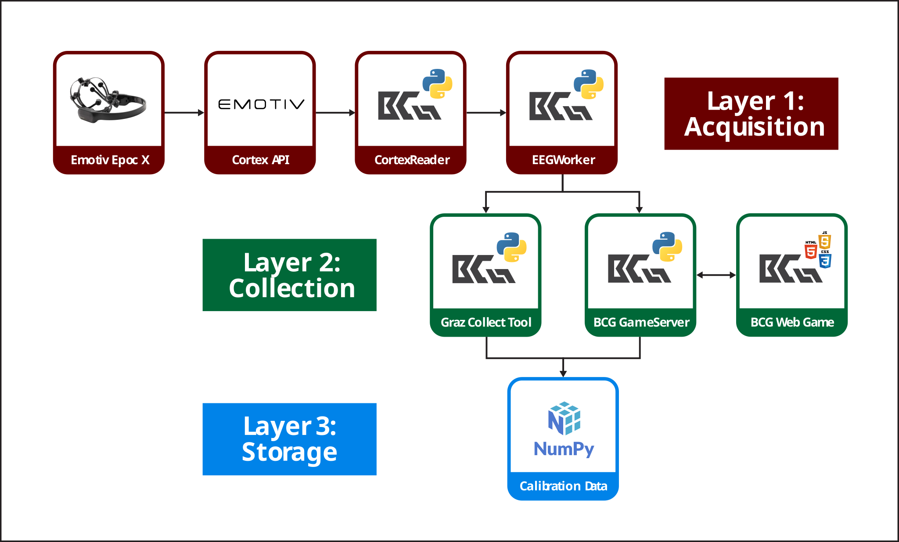

<div align="center">

<picture>
  <source media="(prefers-color-scheme: dark)" srcset="design/Logo/BCG/bcg-full-logo-white@3x.png">
  
</picture>

# BCG: A Game-Based Approach to Motor Imagery Adaptation and BCI Calibration

**Collect labeled motor imagery EEG with a two-lane rhythm game, or with the classic Graz protocol.**


[About](#about) · [What it does](#what-it-does) · [Repository contents](#repository-contents) · [Quick start](#quick-start) · [Acknowledgements](#acknowledgements) · [License](#license)

[▶ Watch the demo](demo.mp4)

</div>

---

Honours project for the BSc (Hons) Computer Science at **Birmingham City University** (module CMP6200 Individual Honours Project, 2025-2026).

| | |
|---|---|
| **Author** | Dang Khoa Cao (University of Information Technology, VNU-HCM; Birmingham City University) |
| **Supervisor** | Dr. Chi Thanh Vi |

## About

EEG-based motor imagery (MI) Brain-Computer Interfaces (BCIs) hold significant promise for assistive technology and rehabilitation. However, standard calibration protocols require repetitive cue-driven trials, supervised setup, and can induce user fatigue. This project presents BCG, a dual-mode software framework supporting both the traditional Graz protocol and a gamified protocol for collecting motor imagery calibration data. The gamified protocol embeds left- and right-hand motor imagery tasks in predetermined game events rather than presenting them as explicit calibration prompts, enabling automated trial labeling based on the intended task. BCG integrates a consumer EEG headset, a web-based rhythm game, and a server-side collection pipeline to support session-level data export for offline analysis and future calibration workflows. In a pilot between-subjects study with 10 analyzed participants, gamification reduced Mental Demand compared with the Graz protocol (p = 0.047, uncorrected), while also showing lower mean scores on several other NASA-TLX dimensions. These preliminary findings suggest that gamification may help reduce the perceived cognitive workload of motor imagery calibration.

## What it does

BCG records labeled EEG trials with either of two protocols and saves them for offline analysis.

<div align="center">

<br>
<sub>System flow in three layers. Emotiv and other logos are trademarks of their owners.</sub>
<br>
</div>

|  | Graz protocol | Gamified protocol |
|---|---|---|
| **What it is** | A desktop application that shows cues and records timed windows | A two-lane rhythm game in the browser plus a local server |
| **Cue** | Class name and arrow in class color | The lane of the falling tile |
| **Label** | The cued class | The lane (the intended class) |

It works with an **Emotiv EPOC X** headset (14 electrodes), or in a **simulation mode** that needs no headset.

## Repository contents

```
Honours Project/
├── artefact/     the software: Graz tool, game server, browser game, live monitor, tests
├── model/        notebooks that train motor imagery models on several public datasets
├── design/       figures, posters, report cover and logos (exports and Illustrator sources)
├── documents/    project reports, progress reviews, weekly reports, handbook, Gantt chart
└── demo.mp4      demo video of the Graz protocol and the gamified protocol
```

| Folder | What it is |
|---|---|
| [`artefact/`](artefact/) | The BCG software, with its own [README](artefact/README.md), license and tests |
| [`model/`](model/) | Notebooks that train MI models on public datasets (for example BCI Competition IV 2a and MIMED) |
| [`design/`](design/) | Figures, posters, report cover and logos |
| [`documents/`](documents/) | Project reports, progress reviews, weekly reports, handbook, Gantt chart |

`model/` is a needed step: the EPOC X lacks some electrodes (such as Cz) that openly available models expect, so models are trained on public datasets. The resulting weights are used by the experimental Live MI Monitor, and the paper does not report their results. The datasets and weights are not tracked in this repository.

**At a glance:** Python (PyQt6, NumPy, a WebSocket server), a JavaScript browser game and the Emotiv Cortex API. The pilot study had 13 volunteers, of whom 10 (five per group) were analyzed; Mental Demand was lower with the gamified protocol, as an exploratory result.

## Quick start

Setup, simulation mode and the output format are in [`artefact/README.md`](artefact/README.md). No headset is needed in simulation mode.

```bash
cd artefact
python3 -m venv venv && source venv/bin/activate
pip install -r requirements.txt
python main.py
```

## Acknowledgements

Every project has a cast. This one had:

- **Dr. Chi Thanh Vi**, my supervisor, who gave me the chance to work on EEG-based brain-computer interfaces, a field that is still very new and hard to reach in Vietnam. He was always open to helping and provided the best conditions to finish this project.
- **Ms. Trang (Hoang Trang Nguyen)**, for valuable advice, writing guidance and practical experience with the data collection process.
- **Brain-Life Link Technology JSC**, for lending the main EEG device and letting me try several EEG devices, and **Emotiv**, for sponsoring the software license that gave access to the raw EEG data. Without the gear, this would have been a very quiet project.
- **The volunteers** who sat still, imagined moving their hands, and then rated how tiring it was. Thirteen of you took part, ten made it into the analysis, and all of you have my thanks.

## License

- **Code in `artefact/`:** GNU General Public License v3.0 or later. See [`artefact/LICENSE`](artefact/LICENSE).
- **Everything else** (reports, posters, figures, logos, video): all rights reserved.
- Logos and trademarks (Emotiv, Birmingham City University, University of Information Technology) belong to their owners and are not covered by this license.

<div align="center">
<sub>Honours Project · Birmingham City University · 2025-2026</sub>
</div>
